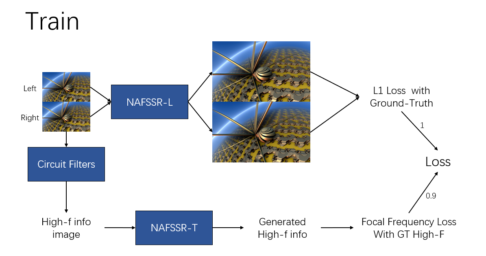
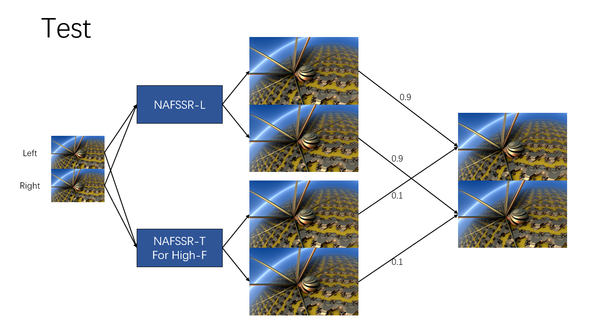

## NUSRISZ_STEREO
#### Yiheng Wang,Gang Zhu

The official pytorch implementation of the paper **[NAFSSR: Stereo Image Super-Resolution Using NAFNet](https://arxiv.org/abs/2204.08714)**.
You can get more infomation about NAFSSR with folloing links: [[video](https://drive.google.com/file/d/16w33zrb3UI0ZIhvvdTvGB2MP01j0zJve/view)]/[[slides](https://data.vision.ee.ethz.ch/cvl/ntire22/slides/Chu_NAFSSR_slides.pdf)]/[[poster](https://data.vision.ee.ethz.ch/cvl/ntire22/posters/Chu_NAFSSR_poster.pdf)].
#### Xiaojie Chu\*, Liangyu Chen\*, Wenqing Yu

>This paper proposes a simple baseline named NAFSSR for stereo image super-resolution. We use a stack of NAFNet's Block (NAFBlock) for intra-view feature extraction and combine it with Stereo Cross Attention Modules (SCAM) for cross-view feature interaction.


>NAFSSR outperforms the state-of-the-art methods on the KITTI 2012, KITTI 2015, Middlebury, and Flickr1024 datasets. With NAFSSR, we won **1st place**  in the [NTIRE 2022 Stereo Image Super-resolution Challenge](https://codalab.lisn.upsaclay.fr/competitions/1598). 
# Model Preview 
|  |  | 
|:---------------------------------------------------------------------------:|:--------------------------------------------------------------------------------:|
|                              Training Process                               |                                   Test Process                                   |             

[//]: # (![Training Process]&#40;./figure/train.png&#41;)

[//]: # (![Test Process]&#40;./figure/test.png&#41;)
# Installation
This implementation based on [BasicSR](https://github.com/xinntao/BasicSR) which is a open source toolbox for image/video restoration tasks and [HINet](https://github.com/megvii-model/HINet) 

```python
python 3.9.5
pytorch 1.11.0
cuda 11.3
```

```
git clone https://github.com/megvii-research/NAFNet
cd NAFNet
pip install -r requirements.txt
python setup.py develop --no_cuda_ext
```


# Reproduce the Stereo SR Results 

## 1. Data Preparation
Follow previous works, our models are trained with Flickr1024 and Middlebury datasets, which is exactly the same as <a href="https://github.com/YingqianWang/iPASSR">iPASSR</a>. Please visit their homepage and follow their instructions to download and prepare the datasets.

#### Download and prepare the train set and place it in ```./datasets/StereoSR```

#### Download and prepare the evaluation data and place it in ```./datasets/StereoSR/test```

#### Run ```./stereo/datasets/GenerateTrainingPatches.m```to generate training sets.

The structure of `datasets` directory should be like
```
    stereo
    ├── datasets
    │   ├── Train_patches_x4
    │   │   ├── 000001
    │   │   ├── 000002
    │   │   │   ├── hr0.png
    │   │   │   ├── hr1.png
    │   │   │   ├── lr0.png
    │   │   │   └── lr1.png
    │   │   ├── ...
    │   │   ├── 040651
    │   │   └── 040652
    |   ├── Val_patches_x4
    │   │   ├── 000001
    │   │   ├── 000002
    │   │   │   ├── hr0.png
    │   │   │   ├── hr1.png
    │   │   │   ├── lr0.png
    │   │   │   └── lr1.png
    │   │   ├── ...
    │   │   ├── 003329
    │   │   └── 003330
```
We choose the ID 701-800 from the raw training sets to be as our validation sets.
## 2. Training Process
Follow previous works, we have prepared datasets that we need.Now please follow processing blow to train the model.

#### Download and prepare the train set and place it in ```./datasets/StereoSR```

#### Download and prepare the evaluation data and place it in ```./datasets/StereoSR/test```
* NAFNet-L for 4x SR:

  ```
  python -m torch.distributed.launch --nproc_per_node=8 --master_port=4321 basicsr/train.py -opt options/train/NAFSSR/NAFSSR-L_x4.yml --launcher pytorch
  ```

* NAFNet-T for 4x SR for High or Low frequency information:
##### FOR _High frequency_ information,replace something in ```./basicsr/data/paired_image_SR_LR_dataset.py```
```
    class PairedStereoImageDataset(data.Dataset):
    ...
    ...
    return {
            'lq': img_lq_h,
            'gt': img_gt_h,
             # 'lq_h': img_lq_h,
             # 'gt_h': img_gt_h,
             # 'lq_l': img_lq_l,
             # 'gt_l': img_gt_l,
            'lq_path': os.path.join(self.lq_folder, self.lq_files[index]),
            'gt_path': os.path.join(self.gt_folder, self.gt_files[index]),
        }

    def __len__(self):
        return self.nums
```
#### FOR _Low frequency_ information,replace something in ```./basicsr/data/paired_image_SR_LR_dataset.py```
```
    class PairedStereoImageDataset(data.Dataset):
    ...
    ...
    return {
            'lq': img_lq_l,
            'gt': img_gt_l,
             # 'lq_h': img_lq_h,
             # 'gt_h': img_gt_h,
             # 'lq_l': img_lq_l,
             # 'gt_l': img_gt_l,
            'lq_path': os.path.join(self.lq_folder, self.lq_files[index]),
            'gt_path': os.path.join(self.gt_folder, self.gt_files[index]),
        }

    def __len__(self):
        return self.nums
```
  ```
  python -m torch.distributed.launch --nproc_per_node=8 --master_port=4321 basicsr/train.py -opt options/train/NAFSSR/NAFSSR-T_x4.yml --launcher pytorch
  ```

* 8 gpus by default. Set ```--nproc_per_node``` to # of gpus for distributed validation.

## 3. Evaluation


#### Download the pretrain model in ```./experiments/pretrained_models/```

| name | scale |#Params|PSNR|SSIM| pretrained models | configs |
|:----:|:----:|:----:|:----:|:----:|:----:|-----:|
|NAFSSR-T|x4|0.46M|23.69|0.7384|[gdrive](https://drive.google.com/file/d/1owfYG1KTXFMl4wHpUZefWAcVlBpLohe5/view?usp=sharing)  \|  [baidu](https://pan.baidu.com/s/1yC5XzJcL5peC1YuW3MkFMA?pwd=5j1u)|[train](../options/test/NAFSSR/NAFSSR-T_4x.yml) \| [test](../options/test/NAFSSR/NAFSSR-T_4x.yml)|
|NAFSSR-S|x4|1.56M|23.88|0.7468|[gdrive](https://drive.google.com/file/d/1RpfS2lemsgetIQwBwkZpZwLBJfOTDCU5/view?usp=sharing)  \|  [baidu](https://pan.baidu.com/s/1XvwM5KVhNsKAxWbxU85SFA?pwd=n5au)|[train](../options/test/NAFSSR/NAFSSR-S_4x.yml) \| [test](../options/test/NAFSSR/NAFSSR-S_4x.yml)|
|NAFSSR-B|x4|6.80M|24.07|0.7551|[gdrive](https://drive.google.com/file/d/1Su0OTp66_NsXUbqTAIi1msvsp0G5WVxp/view?usp=sharing)  \|  [baidu](https://pan.baidu.com/s/18tVlH-QIVtvDC1LM2oPatw?pwd=3up5)|[train](../options/test/NAFSSR/NAFSSR-B_4x.yml) \| [test](../options/test/NAFSSR/NAFSSR-B_4x.yml)|
|NAFSSR-L|x4|23.83M|24.17|0.7589|[gdrive](https://drive.google.com/file/d/1TIdQhPtBrZb2wrBdAp9l8NHINLeExOwb/view?usp=sharing)  \|  [baidu](https://pan.baidu.com/s/1P8ioEuI1gwydA2Avr3nUvw?pwd=qs7a)|[train](../options/test/NAFSSR/NAFSSR-L_4x.yml) \| [test](../options/test/NAFSSR/NAFSSR-L_4x.yml)|

*PSNR/SSIM are evaluate on Flickr1024 test set.*


### Testing on Flickr1024 datasets

  * NAFSSR-T for 4x SR:

```
python -m torch.distributed.launch --nproc_per_node=1 --master_port=4321 basicsr/test.py -opt ./options/test/NAFSSR/NAFSSR-T_x4.yml --launcher pytorch
```

  * NAFSSR-S for 4x SR:

```
python -m torch.distributed.launch --nproc_per_node=1 --master_port=4321 basicsr/test.py -opt ./options/test/NAFSSR/NAFSSR-S_x4.yml --launcher pytorch
```

  * NAFSSR-B for 4x SR:

```
python -m torch.distributed.launch --nproc_per_node=1 --master_port=4321 basicsr/test.py -opt ./options/test/NAFSSR/NAFSSR-B_x4.yml --launcher pytorch
```

  * NAFSSR-L for 4x SR:

```
python -m torch.distributed.launch --nproc_per_node=1 --master_port=4321 basicsr/test.py -opt ./options/test/NAFSSR/NAFSSR-L_x4.yml --launcher pytorch
```


* Test by a single gpu by default. Set ```--nproc_per_node``` to # of gpus for distributed validation.


## 4. Generate the final results


  ```
  python ./basicsr/batch_ssr.py
  ```
* Stereo Image Inference Demo:
    * Stereo Image Super-resolution:
    ```
    python basicsr/demo_ssr.py -opt options/test/NAFSSR/NAFSSR-L_4x.yml -opt1 options/test/NAFSSR/NAFSSR-T_4x.yml \
    --input_l_path ./demo/lr_img_l.png --input_r_path ./demo/lr_img_r.png \
    --output_l_path ./demo/sr_img_l.png --output_r_path ./demo/sr_img_r.png
    ```
    * ```--input_l_path```: the path of the degraded left image
    * ```--input_r_path```: the path of the degraded right image
    * ```--output_l_path```: the path to save the predicted left image
    * ```--output_r_path```: the path to save the predicted right image


  


